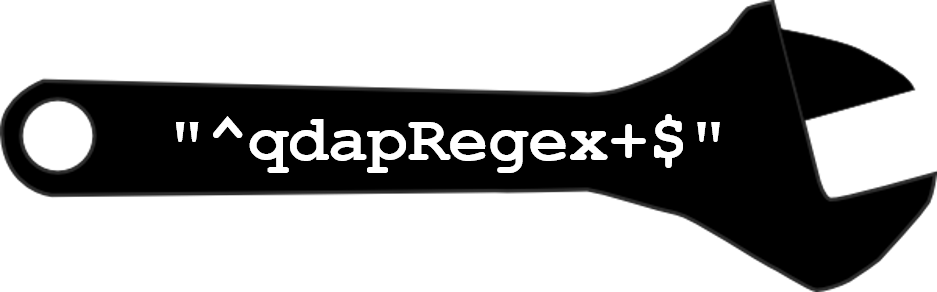

# qdapRegex

```{r, echo=FALSE}
desc <- suppressWarnings(readLines("DESCRIPTION"))
regex <- "(^Version:\\s+)(\\d+\\.\\d+\\.\\d+)"
loc <- grep(regex, desc)
ver <- gsub(regex, "\\2", desc[loc])
verbad <- sprintf('<a href="https://img.shields.io/badge/Version-%s-orange.svg"></a></p>', ver, ver)
````

[](http://www.repostatus.org/#active)
[](https://travis-ci.org/trinker/qdapRegex)
[](https://coveralls.io/r/trinker/qdapRegex)
[](http://dx.doi.org/10.5281/zenodo.11284)
`r verbad`

      
[qdapRegex](http://trinker.github.com/qdapRegex_dev) is a collection of regular expression tools associated with the **qdap** package that may be useful outside of the context of discourse analysis.  Tools include removal/extraction/replacement of abbreviations, dates, dollar amounts, email addresses, hash tags, numbers, percentages, citations, person tags, phone numbers, times, and zip codes.  Functions that remove/replace are prefixed with `rm_`.  Each of these functions has an extraction counterpart prefixed with `ex_`.


The **qdapRegex** package does not aim to compete with string manipulation packages such as [**stringr**](http://cran.r-project.org/package=stringr) or [**stringi**](http://cran.r-project.org/package=stringi) but is meant to provide access to canned, common regular expression patterns that can be used within **qdapRegex**, with **R**'s own regular expression functions, or add on string manipulation packages such as **stringr** and **stringi**.

The functions in **qdapRegex** work on a dictionary system.  The current implementation defaults to a United States flavor of canned regular expressions.  Users may submit proposed region specific regular expression dictionaries that contain the same fields as the [`regex_usa`](http://trinker.github.io/qdapRegex/regex_usa.html) data set or improvements to regular expressions in current dictionaries. Please submit proposed regional regular expression dictionaries via: https://github.com/trinker/qdapRegex/issues

## Educational

The **qdapRegex** package serves a dual purpose of being both functional and educational.  While the canned regular expressions are useful in and of themselves they also serve as a platform for understanding regular expressions in the context of meaningful, purposeful usage.  In the same way I learned guitar while trying to mimic Eric Clapton, not by learning scales and theory, some folks may enjoy an approach of learning regular expressions in a more pragmatic, experiential interaction.  Users are encouraged to look at the regular expressions being used ([`?regex_usa`](http://trinker.github.io/qdapRegex/regex_usa.html) and [`?regex_supplement`](http://trinker.github.io/qdapRegex/regex_supplement.html) are the default regular expression dictionaries used by **qdapRegex**) and unpack how they work.  I have found slow repeated exposures to information in a purposeful context results in acquired knowledge.  

The following regular expressions sites were very helpful to my own regular expression education:

1. [Regular-Expression.info](http://www.regular-expressions.info/tutorial.html)    
2. [Rex  Egg](http://www.rexegg.com/)    
3. [Regular Expressions as used in R](https://stat.ethz.ch/R-manual/R-devel/library/base/html/regex.html)    
4. [Debuggex (Visualizing Regex)](https://www.debuggex.com)    

Being able to discuss and ask questions is also important to learning...in this case regular expressions.  I have found the following forums extremely helpful to learning about regular expressions:

1. [Talk Stats](http://www.talkstats.com/)  +  [Posting Guidelines](http://www.talkstats.com/showthread.php/14960-Forum-Guidelines-Smart-posting-behavior-pays-off)    
2. [stackoverflow](http://stackoverflow.com/)  +  [Posting Guidelines](http://trinker.github.io/stackoverflow/)

## Installation

To download the development version of qdapRegex:

Download the [zip ball](https://github.com/trinker/qdapRegex/zipball/master) or [tar ball](https://github.com/trinker/qdapRegex/tarball/master), decompress and run `R CMD INSTALL` on it, or use the **pacman** package to install the development version:
```r
if (!require("pacman")) install.packages("pacman")
pacman::p_load_gh("trinker/qdapRegex")
```


## Contact

You are welcome to:
* submit suggestions and bug-reports at: <https://github.com/trinker/qdapRegex/issues>
* send a pull request on: <https://github.com/trinker/qdapRegex/>
* compose a friendly e-mail to: <tyler.rinker@gmail.com>

## Examples

The following examples demonstrate some of the functionality of **qdapRegex**.

```{r, echo-FALSE}
library(qdapRegex)
```

### Extract Citations
```{r}
w <- c("Hello World (V. Raptor, 1986) bye (Foo, 2012, pp. 1-2)",
    "Narcissism is not dead (Rinker, 2014)",
    "The R Core Team (2014) has many members.",
    paste("Bunn (2005) said, \"As for elegance, R is refined, tasteful, and",
        "beautiful. When I grow up, I want to marry R.\""),
    "It is wrong to blame ANY tool for our own shortcomings (Baer, 2005).",
    "Wickham's (in press) Tidy Data should be out soon.",
    "Rinker's (n.d.) dissertation not so much.",
    "I always consult xkcd comics for guidance (Foo, 2012; Bar, 2014).",
    "Uwe Ligges (2007) says, \"RAM is cheap and thinking hurts\"",
    "Silly (Bar, 2014) stuff is what Bar (2014, 2012) said."
)

ex_citation(w)
as_count(ex_citation(w))
```

### Extract Twitter Hash Tags, Name Tags, & URLs

```{r}
x <- c("@hadley I like #rstats for #ggplot2 work.",
    "Difference between #magrittr and #pipeR, both implement pipeline operators for #rstats:
        http://renkun.me/r/2014/07/26/difference-between-magrittr-and-pipeR.html @timelyportfolio",
    "Slides from great talk: @ramnath_vaidya: Interactive slides from Interactive Visualization
        presentation #user2014. http://ramnathv.github.io/user2014-rcharts/#1"
)

ex_hash(x)
ex_tag(x)
ex_url(x)
```

### Extract Bracketed Text

```{r}
y <- c("I love chicken [unintelligible]!", 
    "Me too! (laughter) It's so good.[interrupting]",
    "Yep it's awesome {reading}.", "Agreed. {is so much fun}")

ex_bracket(y)
ex_curly(y)
ex_round(y)
ex_square(y)
````

### Extract Numbers

```{r}
z <- c("-2 is an integer.  -4.3 and 3.33 are not.",
    "123,456 is a lot more than -.2",
    "hello world -.q")
rm_number(z)
ex_number(z)
as_numeric(ex_number(z))
```

### Extract Times

```{r}
x <- c(
    "I'm getting 3:04 AM just fine, but...",
    "for 10:47 AM I'm getting 0:47 AM instead.",
    "no time here",
    "Some time has 12:04 with no AM/PM after it",
    "Some time has 12:04 a.m. or the form 1:22 pm"
)
ex_time(x)
as_time(ex_time(x))
as_time(ex_time(x), as.POSIXlt = TRUE)
```

### Remove Non-Words & N Character Words

```{r}
x <- c(
    "I like 56 dogs!",
    "It's seventy-two feet from the px290.",
    NA,
    "What",
    "that1is2a3way4to5go6.",
    "What do you*% want?  For real%; I think you'll see.",
    "Oh some <html>code</html> to remove"
)

rm_non_words(x)
rm_nchar_words(rm_non_words(x), "1,2")
```
